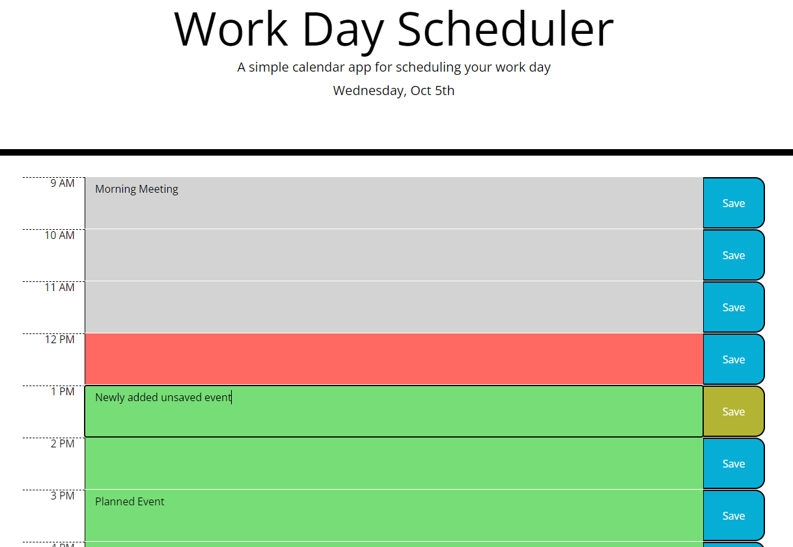

# Work Day Scheduler

# Description
A simple calendar application that allows a user to save events for each hour of the day. Events persist between visits using local storage. Save buttons will turn yellow if the user has modified event data to remind them to save. Rows become gray if they're in the past, green if they're in the future, and red if it is the current hour.

# Screenshots

# Deployed
[https://vicdotexe.github.io/work-day-scheduler/](https://vicdotexe.github.io/work-day-scheduler/)
# Assignment

## *User Story*
```
AS AN employee with a busy schedule
I WANT to add important events to a daily planner
SO THAT I can manage my time effectively
```
## *Acceptance Criteria*
```
GIVEN I am using a daily planner to create a schedule
WHEN I open the planner
THEN the current day is displayed at the top of the calendar
WHEN I scroll down
THEN I am presented with time blocks for standard business hours
WHEN I view the time blocks for that day
THEN each time block is color-coded to indicate whether it is in the past, present, or future
WHEN I click into a time block
THEN I can enter an event
WHEN I click the save button for that time block
THEN the text for that event is saved in local storage
WHEN I refresh the page
THEN the saved events persist
```

# License
[MIT Licence](https://github.com/vicdotexe/work-day-scheduler/blob/main/LICENSE)